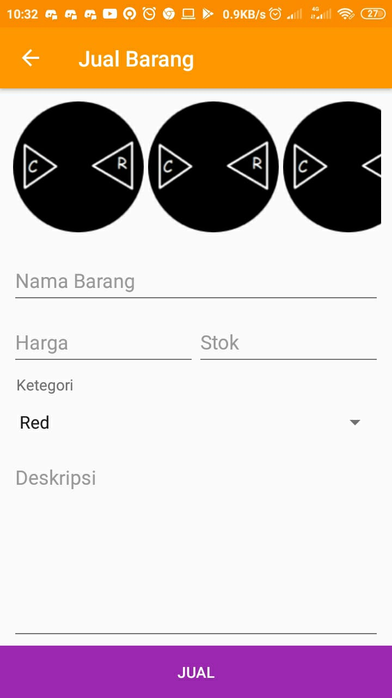
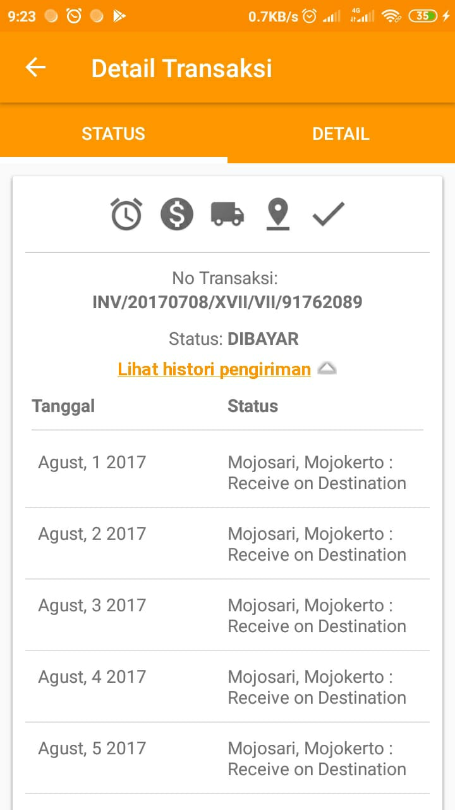

# LAPORAN UAS PEMROGRAMAN MOBILE

## Judul/Nama Aplikasi
Toko Online

Code List :

## Deskripsi Aplikasi
Membuat Aplikasi Toko Online untuk kebutuhan client.

## Identitas Pengembang (Developer)
A Najiyullah(1841720161)

Rei Fangky Primandicka (1841720018)

## Fitur-Fitur Aplikasi

#### Login :

## Saran
Aplikasi ini perlu dikembangkan lagi pada checkout barang dan pemasukkan database.

## Kesimpulan
Aplikasi Toko Online ini bisa digunakan untuk berjualan dan membeli barang untuk konsumen.

## Sumber Data/Referensi

Retrofit : https://square.github.io/retrofit/